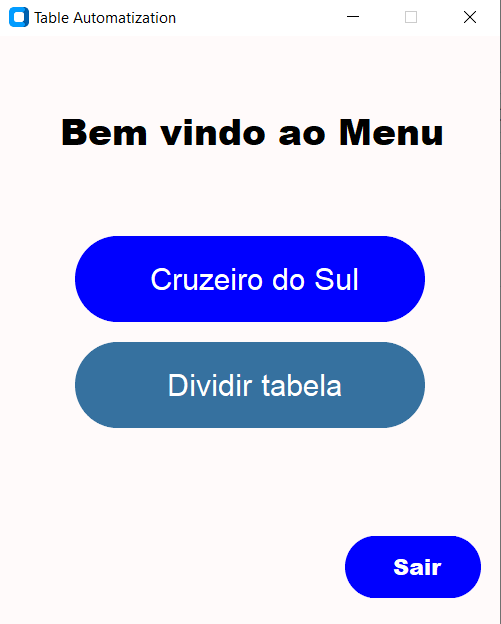
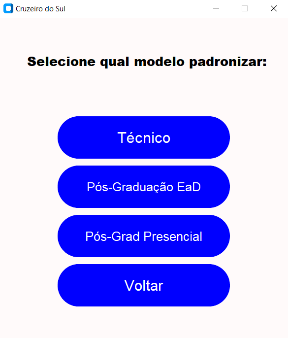
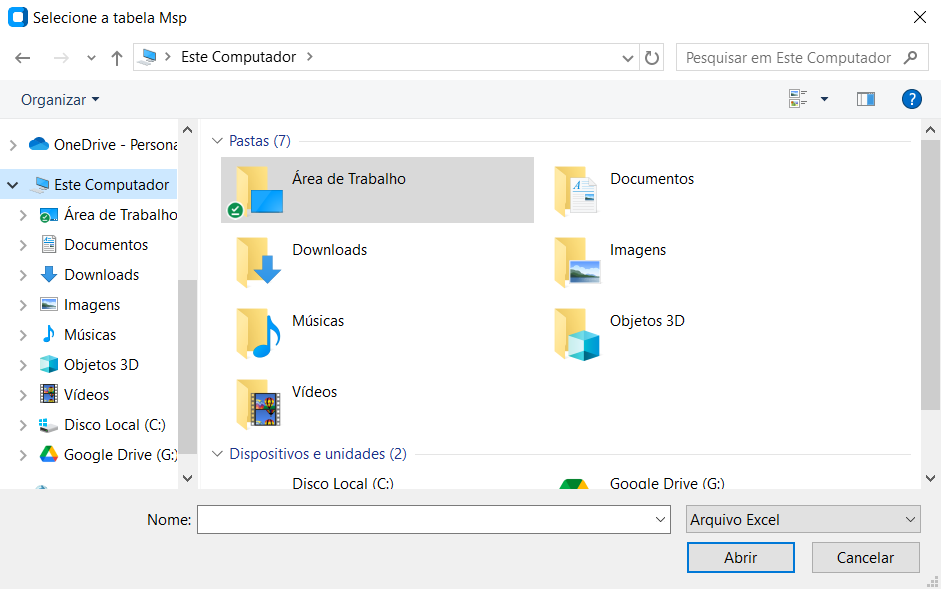
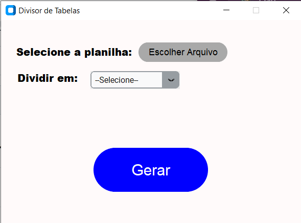

# Table_Automation 📊
## 📌 Descrição
O Table_Automation é uma aplicação desktop desenvolvida em python utilizando as bibliotecas xlwings e customtkinter para automatizar processos de automatização de planilhas, onde há a necessidade de aplicação de fórmulas, manipulação de linhas/colunas, manipulação de abas e geração de arquivos.
Pode ser utilizado para processos especificos da Cruzeiro do Sul assim como para processos mais simples como divisão de tabelas e remoção de duplicatas(em breve).

## 📁 Funcionalidades
✅ Aplicação de fórmulas e recalculo automático    
✅ Manipulação de linhas e colunas    
✅ Aplicação de filtros    
✅ Geração de novos arquivos    
✅ Automatização personalizada    
✅ Interface gráfica simples e intuitiva    
✅ Verificação e separação de pendências    
✅ Mensagens de finalização e alertas    

## 🖥️ Interface Gráfica
A aplicação conta com uma interface gráfica simples, moderna e intuitiva desenvolvida em customtkinter.    

## 📸 Exemplos da Interface Gráfica

### Menus de seleção: 
<p>
    
    
</p>

 ### Seletor de arquivos(informa qual arquivo necessário na parte superior):
 


 ### Interface de divisão de tabelas: 
 


## 🛠 Como Usar
1. Execute o programa (`python Main.py`)  
2. Selecione qual menu deseja abrir (**Cruzeiro do Sul** ou **Dividir Tabela**)  
3. Cruzeiro do Sul:  
    3.1 Selecione qual modelo deseja padronizar  
    3.2 Irá abrir o seletor de arquivos, indicando qual arquivo selecionar na ordem correta  
    3.3 Caso selecione o arquivo errado, basta cancelar no próximo seletor e a operação será retomada(o sistema retornará ao menu de seleção de modelos ou ao seletor anterior).  
4. Dividir Tabela:  
    4.1 Selecione o arquivo `.xlsx`    
    4.2 Selecione em quantos arquivos deseja dividir  
    4.3 Clique em **"Gerar"**  
Aviso⚠: É recomendado separar os arquivos antes da utilização da aplicação pois os que forem criados são salvos automaticamente ao fim do processo no local de origem.

## 🔨 Ferramentas

- Python 3.13
- xlwings
- customtkinter

## ⚙ Execução do projeto
Certifique-se de ter o python instalado.
1. Clone o repositório:
   ```bash
   git clone https://github.com/davisonqueiroz/Table_Automation.git
   ```
2. Instale as dependências:
   ```bash
   pip install customtkinter
   pip install xlwings
   ```
3. Execute o programa:
   ```bash
   python Main.py
   ```
   
